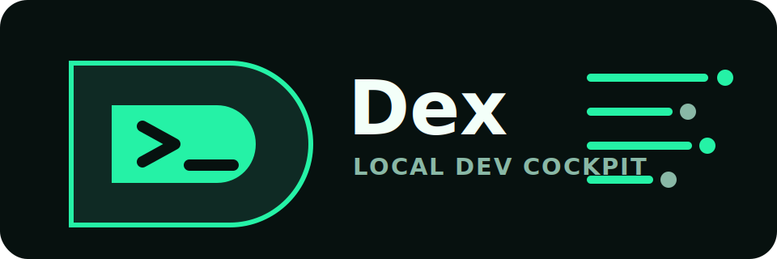

<p align="center">
  
</p>

<p align="center">
  <a href="https://github.com/desenyon/dex/actions"></a>
  <a href="https://github.com/desenyon/dex/releases"></a>
  <a href="LICENSE"></a>
  
</p>

<p align="center">
  <strong>A local-first developer cockpit for the terminal.</strong><br>
  Network, processes, API probes, JSON, system health, regex, benchmarks, files, clipboard, and terminal history in one fast binary.
</p>

---

## Install

```bash
curl -fsSL https://raw.githubusercontent.com/desenyon/dex/main/scripts/install.sh | bash
```

Then run:

```bash
dex
dex --help
```

The install script downloads the latest release binary for macOS or Linux on `arm64` or `amd64`. It installs to `/usr/local/bin` when writable, otherwise to `~/.local/bin`.

## Why Dex

Dex is built for the moment when something local feels slow, exposed, noisy, unstable, or hard to inspect. It is not a daemon and it is not an account-backed service. It is a single local binary that works as a plain CLI and as a keyboard-native terminal dashboard.

```bash
dex network ports
dex process explain-port 3000
dex api get https://example.com
dex json fingerprint response.json
dex regex danger '(a+)+$'
dex system health
```

## Interactive Dashboard

Run `dex` in an interactive terminal to open the TUI dashboard. Use output flags for scripts and automation:

```bash
dex --json
dex system health --markdown
dex network dns example.com --type A --csv
```

TUI keys:

```text
j/k or up/down   move between sections
p or :           command palette
t                theme toggle
home/end         jump through navigation
q or ctrl+c      save session and quit
```

## Command Surface

### Network

```bash
dex network ip
dex network public-ip
dex network interfaces
dex network interface en0
dex network mac
dex network hostname
dex network gateway
dex network routes
dex network dns-config
dex network proxy
dex network vpn
dex network ports
dex network latency example.com --tcp 443
dex network dns example.com --type A
dex network headers https://example.com
dex network ssl example.com
```

### Processes

```bash
dex process list
dex process inspect <pid>
dex process search node
dex process top --limit 5
dex process children <pid>
dex process parent <pid>
dex process ancestry <pid>
dex process family <pid>
dex process sockets <pid>
dex process files <pid>
dex process env <pid>
dex process cwd <pid>
dex process command <pid>
dex process explain-port 3000
```

### API

```bash
dex api get https://example.com
dex api post https://example.com --body body.json
dex api schema response.json
dex api record https://example.com session.dexapi
dex api replay session.dexapi
dex api assert status 200
```

### JSON

```bash
dex json view data.json
dex json minify data.json
dex json validate data.json
dex json query data.json users.0.name
dex json flatten data.json
dex json keys data.json
dex json paths data.json
dex json types data.json
dex json redact data.json
dex json fingerprint data.json
dex json diff old.json new.json
```

### System, Regex, Bench, Files, Clipboard, Terminal

```bash
dex system dashboard
dex system cpu
dex system memory
dex system disk
dex system battery
dex regex test 'user-(\d+)' 'user-42'
dex regex explain '^(user|admin)-\d+$'
dex regex danger '(a+)+$'
dex bench run 'printf dex'
dex files size
dex clipboard save
dex terminal history
```

## Output Modes

Every command is designed for both humans and scripts:

```bash
--json
--csv
--markdown
--raw
--export path
--copy
--save
--watch
--interval 1s
--no-color
--theme dark
--profile default
```

`--save` appends command metadata to `~/.dex/history.db`. `--copy` sends rendered output to the macOS clipboard. `--export` writes the rendered output to a file.

## Local Storage

Dex creates local state under `~/.dex`:

```text
~/.dex/config.toml
~/.dex/history.db
~/.dex/snapshots/
~/.dex/api/
~/.dex/themes/
~/.dex/benchmarks/
~/.dex/clipboard/
~/.dex/terminal/
```

Manage it with:

```bash
dex settings show
dex settings theme dark
dex settings profile default
dex settings history
dex settings storage
```

## Build From Source

This repository bootstraps Go locally under `.tools/go-root` during development, but any compatible Go toolchain can build Dex:

```bash
make qa
bin/dex --help
```

Release archives are produced with:

```bash
VERSION=v0.1.0 scripts/build-release.sh
```

## Project Layout

```text
cmd/dex/             CLI entrypoint
internal/cli/        Cobra command tree and global flags
internal/tui/        Bubble Tea dashboard
internal/network/    Network probes
internal/process/    Process inspection
internal/api/        API requests and session files
internal/jsonx/      JSON exploration and semantic diff
internal/system/     System health probes
internal/regexx/     Regex lab commands
internal/bench/      Command benchmarking
internal/storage/    Config and history storage
internal/output/     Text, JSON, CSV, Markdown, and raw renderers
scripts/             Installer and release build scripts
```

## Status

Dex is an early but working implementation of the full product direction in `AGENTS.md`. The CLI surface is broad and tested. The next frontier is deeper live timelines, richer terminal visualizations, and more advanced recording/replay workflows.
